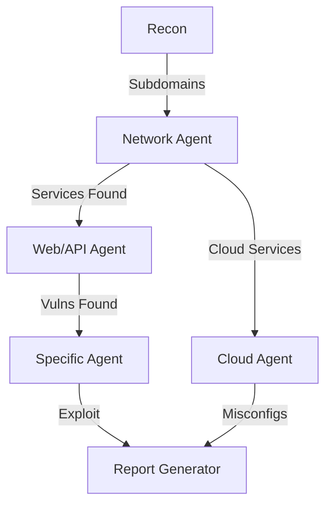

# 📚 Tutorial - Guide d'Utilisation des Agents Spécialisés

## 🚀 Introduction

Ce guide vous explique comment utiliser de manière optimale les agents spécialisés pour vos activités de bug bounty et CTF. Chaque agent est conçu pour maximiser votre efficacité dans son domaine d'expertise.

## 📋 Table des Matières

1. [Démarrage Rapide](#démarrage-rapide)
2. [Utilisation Basique](#utilisation-basique)
3. [Utilisation Avancée](#utilisation-avancée)
4. [Collaboration Multi-Agents](#collaboration-multi-agents)
5. [Mise à Jour des Agents](#mise-à-jour-des-agents)
6. [Workflows Optimaux](#workflows-optimaux)
7. [Tips & Tricks](#tips--tricks)

---

## 🎯 Démarrage Rapide

### 1. Identifier le Domaine
```bash
# Exemples de situations → Agent recommandé
SQLi sur une app web → Web Security Specialist
APK Android à analyser → Mobile Security Specialist
Smart contract buggy → Blockchain Security Specialist
Binary avec ASLR/NX → Binary Exploitation Specialist
```

### 2. Invoquer l'Agent
```markdown
# Format d'invocation
@agent:[nom-du-specialiste] [votre question/contexte]

# Exemple
@agent:web-security-specialist J'ai trouvé un endpoint /api/users 
qui semble vulnérable à l'IDOR, comment l'exploiter?
```

### 3. Fournir le Contexte
Toujours inclure :
- URL/IP de la cible (si applicable)
- Outils disponibles
- Contraintes (temps, scope, etc.)
- Outputs d'énumération déjà obtenus

---

## 🔧 Utilisation Basique

### Structure d'une Requête Efficace

```markdown
# Template Optimal
@agent:[specialiste]

**Contexte**: [Description du challenge/bug]
**Cible**: [URL/IP/Fichier]
**Découvertes**: [Ce que vous avez déjà trouvé]
**Objectif**: [Ce que vous cherchez à accomplir]
**Contraintes**: [Limitations, règles, scope]
```

### Exemples Concrets

#### Web Security
```markdown
@agent:web-security-specialist

**Contexte**: App e-commerce avec panier vulnérable
**Cible**: https://shop.example.com
**Découvertes**: 
- Endpoint POST /api/cart/update sans CSRF token
- Paramètre 'price' modifiable dans la requête
**Objectif**: Acheter des articles à 0€
**Contraintes**: Pas de SQLi autorisé
```

#### Binary Exploitation
```markdown
@agent:binary-exploitation-specialist

**Contexte**: CTF pwn challenge 64-bit
**Cible**: ./vuln_binary
**Découvertes**:
- Buffer overflow dans gets()
- Canary présent mais leak possible
- NX enabled, ASLR off
**Objectif**: Shell sur le serveur distant
```

---

## 🚀 Utilisation Avancée

### 1. Mode Analyse Profonde
```markdown
@agent:[specialiste] --deep-analysis

# Active une analyse plus détaillée avec :
- Multiples vecteurs d'attaque
- Techniques alternatives
- Contournements avancés
- Scripts/PoC personnalisés
```

### 2. Mode Tutoriel
```markdown
@agent:[specialiste] --tutorial

# L'agent explique :
- Concepts théoriques
- Étapes détaillées
- Pourquoi chaque technique fonctionne
- Ressources d'apprentissage
```

### 3. Mode Automation
```markdown
@agent:[specialiste] --automate

# L'agent fournit :
- Scripts d'automatisation
- One-liners efficaces
- Templates de tools
- Commandes à copier/coller
```

### 4. Mode Stealth
```markdown
@agent:[specialiste] --stealth

# Pour bug bounty, éviter la détection :
- Techniques d'évasion IDS/WAF
- Rate limiting respecté
- User-agents légitimes
- Pas de scans agressifs
```

---

## 👥 Collaboration Multi-Agents

### Scénarios Multi-Disciplinaires

#### Web + API + Cloud
```markdown
# Workflow pour app moderne cloud-native
1. @agent:web-security-specialist → Enum frontend
2. @agent:api-security-specialist → Test API endpoints  
3. @agent:cloud-security-specialist → Check misconfigs AWS

# Partage de contexte entre agents
Context: {findings from previous agents}
```

#### Mobile + API + Crypto
```markdown
# App mobile avec backend API et JWT
1. @agent:mobile-security-specialist → Extract API keys
2. @agent:api-security-specialist → Test endpoints
3. @agent:cryptography-specialist → JWT vulnerabilities
```

### Coordination Efficace
```markdown
# Format de handoff entre agents
@agent:current-specialist
Summary: [findings]
Next: @agent:next-specialist should check [specific areas]
```

---

## 🔄 Mise à Jour des Agents

### 1. Ajouter de Nouvelles Techniques

```markdown
# Éditer le fichier de l'agent
nano /home/user1/cyba-HTB/.agents/disciplines/[agent-name].md

# Structure d'ajout
## New Technique/Tool
- **Name**: [Technique name]
- **Description**: [What it does]
- **Usage**: [When to use]
- **Example**: [Code/command example]
```

### 2. Mettre à Jour les Outils

```markdown
# Section Tools du fichier agent
## Tools & Techniques
```bash
# Existing tools...

# NEW TOOL v2.0
- ToolName v2.0
  - New feature X
  - Breaking change Y
  - Migration: [old] → [new]
```

### 3. Ajouter des Patterns CTF/Bug Bounty

```markdown
# Dans la section appropriée
## New CTF Pattern (2024)
- **Challenge Type**: [Web/Pwn/Crypto...]
- **Vulnerability**: [Technical details]
- **Exploitation**: [Step by step]
- **Tools**: [Required tools]
- **Flag Format**: [CTF{...}]
```

### 4. Script de Mise à Jour Automatique

```bash
#!/bin/bash
# update-agents.sh

# Pull latest techniques from sources
echo "🔄 Updating agent knowledge..."

# Add timestamp
echo -e "\n## Last Updated: $(date)" >> $1

# Commit changes
git add .agents/
git commit -m "Update agents with latest techniques"
```

---

## 📊 Workflows Optimaux

### Bug Bounty Workflow



```markdown
# Commandes workflow
1. @agent:enumeration-specialist → Initial recon
2. @agent:network-security-specialist → Service enum
3. @agent:[domain-specialist] → Deep testing
4. @agent:report-generator → Create submission
```

### CTF Competition Workflow

```markdown
# Speed Run Strategy
1. Identifier la catégorie rapidement
2. @agent:[specialist] --quick-wins
3. Si bloqué → @agent:[specialist] --hints
4. Flag trouvé → @agent:report-generator --writeup
```

### Red Team Operation

```markdown
# Covert Operation Flow
1. @agent:network-security-specialist --stealth
2. @agent:web-security-specialist --low-and-slow  
3. @agent:binary-exploitation-specialist --persistence
4. @agent:forensics-specialist --anti-forensics
```

---

## 💡 Tips & Tricks

### 1. Optimisation des Requêtes

```markdown
# ❌ Mauvais
"Comment hacker ce site?"

# ✅ Bon  
"J'ai trouvé SQLi sur /login avec ' OR '1'='1, 
comment dumper la database MySQL?"
```

### 2. Chaînage Intelligent

```markdown
# Utiliser les outputs d'un agent pour le suivant
Agent1 Output: Found AWS keys in JS file
→ @agent:cloud-security-specialist Use these keys: [AKIA...]
```

### 3. Mode Debug

```markdown
# Quand ça ne marche pas
@agent:[specialist] --debug
Provide:
- Exact error messages
- Tool versions  
- OS/environment
- Previous attempts
```

### 4. Learning Mode

```markdown
# Pour comprendre, pas juste exploiter
@agent:[specialist] --explain-like-beginner
@agent:[specialist] --show-vulnerable-code
@agent:[specialist] --defensive-measures
```

### 5. Automation Scripts

```bash
# Quick invoke script
#!/bin/bash
# invoke-agent.sh

AGENT=$1
QUERY=$2
echo "@agent:$AGENT $QUERY" | cyba-ai-process
```

---

## 📈 Métriques de Succès

### Indicateurs d'Utilisation Efficace

1. **Temps de Résolution** ↘️
   - Avant: 2h pour trouver vuln
   - Après: 30min avec bon agent

2. **Taux de Succès** ↗️
   - Plus de bugs trouvés
   - Meilleure sévérité
   - Moins de duplicates

3. **Qualité des Reports** ⭐
   - PoC plus clairs
   - Impact mieux démontré  
   - Remediation incluse

---

## 🆘 Troubleshooting

### Agent ne répond pas comme attendu
```markdown
1. Vérifier le nom exact de l'agent
2. Inclure plus de contexte
3. Essayer --verbose mode
4. Diviser en questions plus petites
```

### Techniques outdated
```markdown
1. Mettre à jour le fichier agent
2. Ajouter [DEPRECATED] aux vieilles techniques
3. Indiquer les alternatives modernes
```

### Collaboration difficile
```markdown
1. Créer un contexte partagé
2. Utiliser un format standard
3. Faire des handoffs explicites
4. Documenter les findings
```

---

## 🎓 Formation Continue

### Ressources Recommandées
- **Web**: PortSwigger Academy, OWASP
- **Binary**: pwn.college, ROP Emporium  
- **Mobile**: MOBISEC, Android Security
- **Cloud**: AWS Security, GCP Security
- **Blockchain**: Ethernaut, Damn Vulnerable DeFi

### Practice Platforms
- HackTheBox (tous domaines)
- TryHackMe (débutant-friendly)
- PentesterLab (web focus)
- pwnable.kr (binary)
- CryptoHack (crypto)

---

## 📝 Notes Finales

1. **Personnalisation**: Adaptez les agents à vos besoins
2. **Contribution**: Partagez vos discoveries
3. **Éthique**: Toujours respecter le scope
4. **Learning**: Les agents sont des guides, pas des solutions magiques
5. **Practice**: Plus vous utilisez, plus vous maîtrisez

---

*Happy Hacking! 🎯*